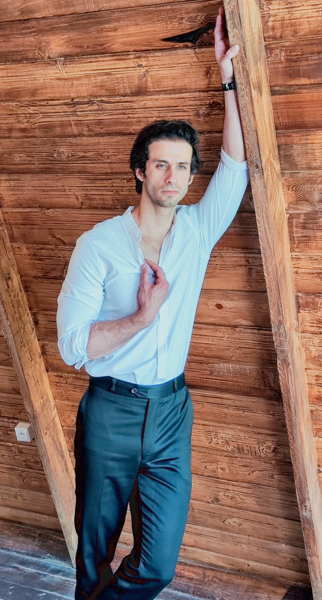
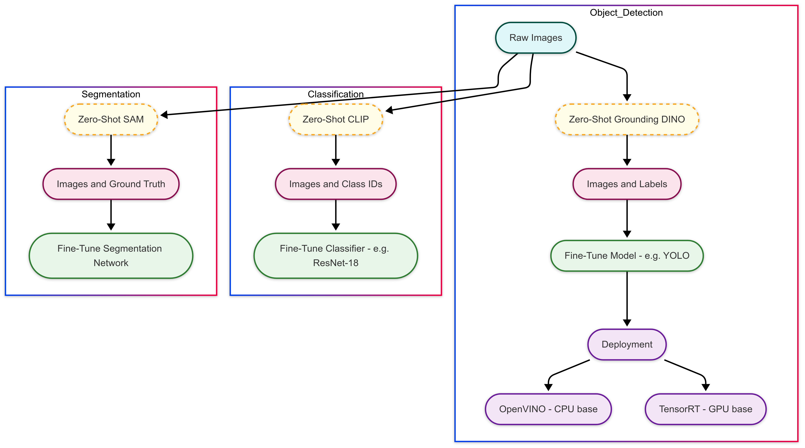

  

### 🔍 Computer Vision Tasks Workflow

  

<h1 align="center">👋 Hi, I’m Alireza Kanani</h1>

  

  🎓 MSc in Electrical & Communication Engineering • 📍 Tehran, Iran

---

### 🔭 I’m currently working on

- 🤖 Deploying real‐time vision pipelines on NVIDIA Jetson (Nano, Xavier, Orin)
- 🤖 Developing and deploying trading bot pipeline.

---

- **Machine Learning Frameworks & Libraries**  TensorFlow, Keras, PyTorch, CUDA (GPU Programming),
ONNX, TensorRT, OpenVINO, YOLO, GroundingDINO,
Huggingface, GStreamer, DeepStream, GST-shark,
OpenCV, Scikit-learn, SciPy, Mediapipe,
Vision Transformer(ViT)
- **Embedded Systems**: Jetson Nano, Jetson Xavier NX, Jetson Orin Nano
### 🌱 My Passions
- **Computer Vision**: Object detection & tracking, Unsupervised learning, Human robot interaction
 

---

### 💼 Experience Highlights
| Company / Project                         | Role & Technologies                                 |
|-------------------------------------------|-----------------------------------------------------|
| **Syna Company** (Oct 2023 – Mar 2025)     | ML deployment on Jetson (C++/Python, DeepStream)    |
| **Persian Handwriting OCR** (2022)        | OCR pipeline with CNN & deep learning               |
| **Remote Sensing Tracker** (2022)         | Optical‑flow tracking on embedded Raspberry Pi      |
| **3D Face Reconstruction** (2023)         | PRNet & HRN for texture‑based expression mapping    |
| **Defect Detection** (Master’s Thesis)    | CNN‑based industrial defect segmentation            |

---

### 🛠️ Tech Stack

  
  
  
  
  
  
  
  

---

### 📊 GitHub Stats

  
  &nbsp;&nbsp;
  

---

### 📫 Let’s Connect
- ✉️ alirezakanani.project@gmail.com   
- 🔗 [LinkedIn](https://www.linkedin.com/in/alireza-kanani-b7323b1bb)  
- 🚀 Open to collaborations in AI, CV & embedded systems!

---

  Built with ❤️ and ☕ by Alireza Kanani

